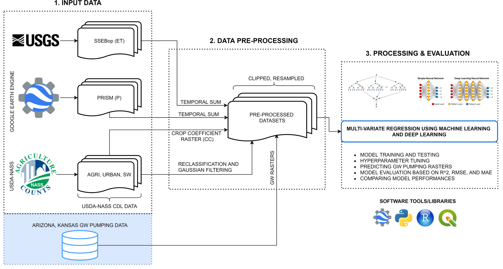
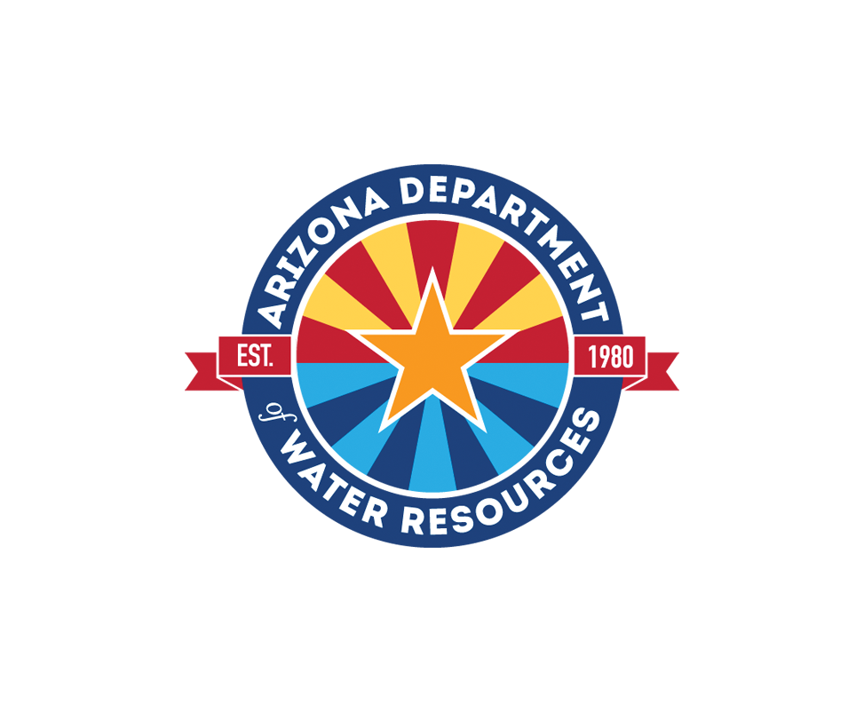

# Estimating Local-Scale Groundwater Withdrawals Using Integrated Remote Sensing Products and Deep Learning

## Abstract
Groundwater plays a critical role in the water- food-energy nexus and extensively supports global drinking water and food production. Despite the pressing demands for groundwater resources, groundwater withdrawals are not actively monitored in most regions. Thus, reliable methods are required to estimate withdrawals at local scales suitable for implementing sustainable groundwater management practices. Here, we combine publicly available remote sensing datasets into a deep learning framework for estimating groundwater withdrawals at high resolution (5 km) over the states of Arizona and Kansas in the USA. We compare ensemble machine learning and deep learning algorithms using groundwater pumping data from 2002–2019. Our research shows promising results in sub-humid and semi-arid (Kansas) and arid (Arizona) regions, which demonstrates the robustness and extensibility of this integrated approach. The success of this method indicates that we can effectively and accurately estimate local-scale groundwater withdrawals under different climatic conditions and aquifer properties.



## Publications
Related conference paper:  https://ieeexplore.ieee.org/document/9554784

Citation:
```
@INPROCEEDINGS{9554784,
  author={Majumdar, Sayantan and Smith, Ryan and Conway, Brian D. and Butler, James J. and Lakshmi, Venkataraman and Dagli, Cihan H.},
  booktitle={2021 IEEE International Geoscience and Remote Sensing Symposium IGARSS}, 
  title={Estimating Local-Scale Groundwater Withdrawals Using Integrated Remote Sensing Products and Deep Learning}, 
  year={2021},
  volume={},
  number={},
  pages={4304-4307},
  doi={10.1109/IGARSS47720.2021.9554784}}
}
```

 &nbsp;  &nbsp;  &nbsp;  &nbsp;  &nbsp; 